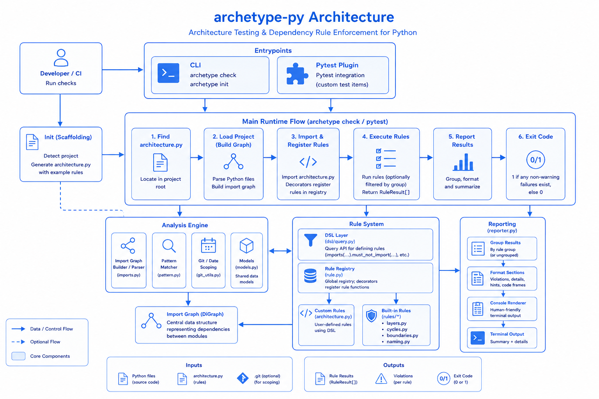
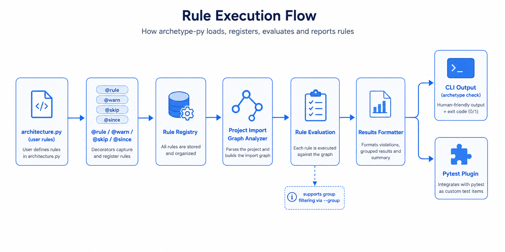
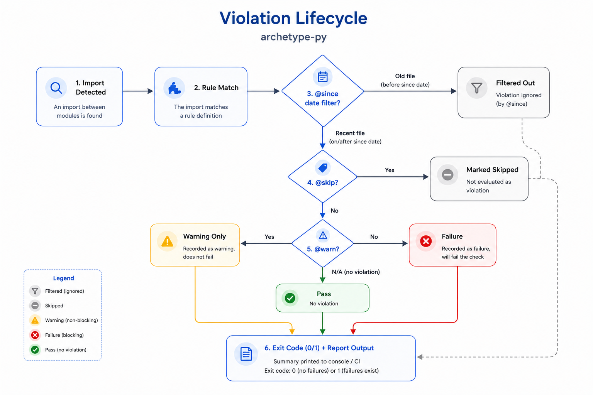
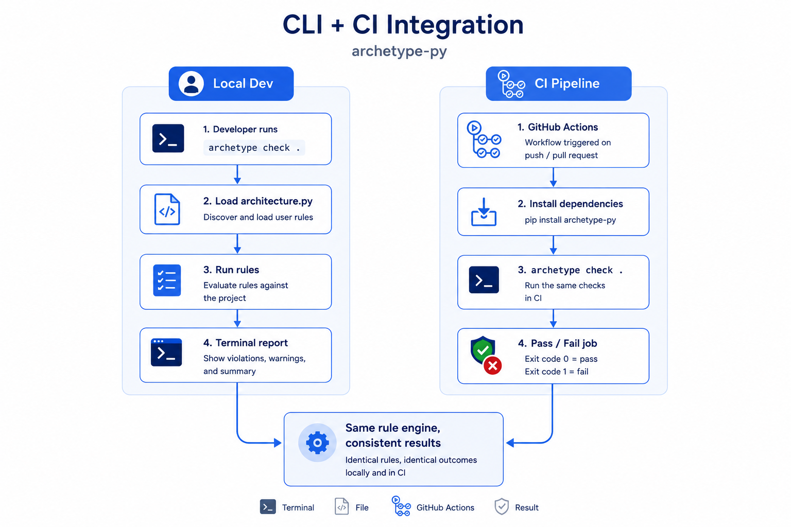
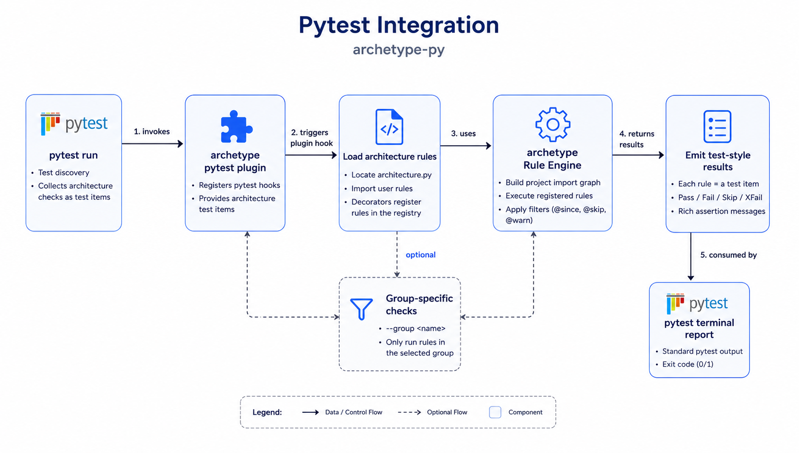

[](https://pypi.org/project/archetype-py/)
[](https://pypi.org/project/archetype-py/)
[](https://github.com/MossabArektout/archetype-py/blob/main/LICENSE)
[](https://github.com/MossabArektout/archetype-py/actions/workflows/ci.yml)

# archetype-py

## Table of Contents

- [Overview](#overview)
- [archetype-py Logo](#archetype-py-logo)
- [Architecture Visuals](#architecture-visuals)
- [Why Developers Use archetype-py](#why-developers-use-archetype-py)
- [See It In Action](#see-it-in-action)
- [Quick Start](#quick-start)
- [Minimum `architecture.py` Example](#minimum-architecturepy-example)
- [Features](#features)
- [Decorators and Commands](#decorators-and-commands)
- [Perfect For](#perfect-for)
- [Installation](#installation)
- [Build & Test](#build--test)
- [Exit Codes](#exit-codes)
- [Troubleshooting](#troubleshooting)
- [Roadmap](#roadmap)
- [Contributing](#contributing)
- [Support The Project](#support-the-project)

## Overview

archetype-py is a Python architecture testing library that helps teams define structural rules as code and enforce them continuously. Instead of relying on conventions alone, you can codify boundaries such as layer direction, forbidden dependencies, module visibility, and cycle prevention, then run those checks locally, in CI, and in pytest. This keeps architecture decisions explicit, reviewable, and resilient as the codebase grows.

## archetype-py Logo

<p align="center">
  
</p>

## Architecture Visuals

### Architecture Diagram
archetype-py lets teams define architecture rules like:

- “API must not depend on infrastructure”
- “No cycles between services”
- “Only repositories can access the database”

…and automatically enforce them in CI, locally, and in pytest.

<p align="center">
  
</p>

### Rule Execution Flow

<p align="center">
  
</p>


### Violation Lifecycle

<p align="center">
  
</p>

### CLI + CI Diagram

<p align="center">
  
</p>

### pytest Integration

<p align="center">
  
</p>

---

## Why Developers Use archetype-py

Most Python tooling checks:

- formatting
- typing
- linting
- correctness

But almost nothing protects **system structure**.

As projects grow, architecture drifts silently:
- layers start leaking
- imports become tangled
- boundaries disappear
- coupling spreads

archetype-py turns architectural intent into executable checks.

---

## See It In Action

### Define architecture rules

```python
from archetype import rule
from archetype.rules import layers

@rule("layers are ordered")
def layer_order() -> None:
    layers(["myapp.api", "myapp.services", "myapp.db"]).are_ordered()
```

### Run checks

```bash
archetype check .
```

### Get actionable feedback

```text
✖ API cannot depend on DB internals

app.api.users
└── imports app.db.internal.session
```

---

## Quick Start

### 1. Install

```bash
pip install archetype-py
```

### 2. Generate a starter architecture file

```bash
archetype init .
```

### 3. Define your rules

Edit:

```text
architecture.py
```

### 4. Run checks

```bash
archetype check .
```

### 5. Add to CI

```yaml
- run: archetype check .
```

Done.

---

## Minimum `architecture.py` Example

Use this as a starting point when creating or refining your rules file:

```python
from archetype import group, imports, rule, since, warn
from archetype.rules import no_cycles

with group("Layer boundaries"):
    @rule("api-must-not-import-db")
    def api_must_not_import_db() -> None:
        imports("myapp.api").must_not_import("myapp.db")

@rule("db-warning-example")
@warn
def db_warning_example() -> None:
    imports("myapp.services").must_not_import("myapp.db.internal")

@rule("recent-violations-only")
@since("2026-01-01")
def recent_violations_only() -> None:
    imports("myapp.api").must_not_import("myapp.legacy")

@rule("no-import-cycles")
def no_import_cycles() -> None:
    no_cycles("myapp")
```

---

## Features

### Architecture Rules
- Forbidden imports
- Allowlisted imports
- Layer enforcement
- Import cycle detection
- Protected module boundaries

### Workflow Features
- Rule grouping
- Warning-level rules
- Temporary rule skips with context
- Changed-file enforcement (`since`)
- Pytest integration
- CI-friendly exit codes

## Decorators and Commands

Rules are written in `architecture.py` with decorators. Below are all decorator-style rule helpers currently available in this library.

| Decorator / Helper | Purpose | Example |
|---|---|---|
| `@rule("name")` | Registers a rule with a human-readable display name. | `@rule("api-not-db")` |
| `@warn` | Marks a rule as warning-only (does not fail exit code). | `@warn` |
| `@skip` / `@skip(reason="...")` | Temporarily skips a rule, optionally with a reason shown in output. | `@skip(reason="Refactor in progress")` |
| `@since("YYYY-MM-DD")` | Limits violations to files changed since a specific date. | `@since("2026-01-01")` |
| `group("name")` | Context manager that assigns a group to enclosed rules (used with `--group`). | `with group("Layer boundaries"):` |

Decorator order tip: place `@rule(...)` first, then wrappers like `@warn`, `@skip`, or `@since`.

| Command | Description | Example |
|---|---|---|
| `archetype init [path]` | Detects project structure and generates a starter `architecture.py` file. | `archetype init .` |
| `archetype check [path]` | Loads `architecture.py` and runs all registered architecture rules. | `archetype check .` |
| `archetype check [path] --group <name>` | Runs only rules that belong to the specified group. | `archetype check . --group core` |


## Perfect For

- Growing Python monoliths
- Modular backends
- Clean Architecture projects
- Hexagonal Architecture
- Domain-driven design
- Teams scaling beyond “tribal knowledge”

---

## Installation

```bash
pip install archetype-py
```

Requires Python 3.11+.

---

## Build & Test

For local development, install dev dependencies, run the test suite, and run architecture checks before opening a PR.

```bash
pip install -e ".[dev]"
pytest
archetype check .
```


---

## Exit Codes

- `0`: no blocking failures (passes and warnings only)
- `1`: one or more blocking rule failures

---

## Troubleshooting

- `Error: architecture.py not found`: run `archetype init .` in your project root, or pass the correct path to `archetype check <path>`.
- Rules seem to do nothing: confirm your rules are decorated with `@rule("...")`; undecorated functions are not registered.
- `@since(...)` behavior is unexpected: verify the date format is `YYYY-MM-DD` and that your git history is available in the checked path.
- Import path mismatches: use fully qualified module paths (`myapp.api`, not file paths like `src/api.py`).

---

## Roadmap

Planned improvements include:
- Graph visualization
- Architecture diffing
- IDE integrations
- Rich HTML reports
- More built-in rule primitives

---

## Contributing

Contributions are welcome:
- bug fixes
- rule ideas
- docs improvements
- integrations
- performance work

See [CONTRIBUTING.md](./CONTRIBUTING.md).

---

## Support The Project

If archetype-py helps your team:

⭐ Star the repository  
🐛 Open issues  
🧠 Share feedback  
🔧 Contribute improvements

Every star genuinely helps the project grow.
