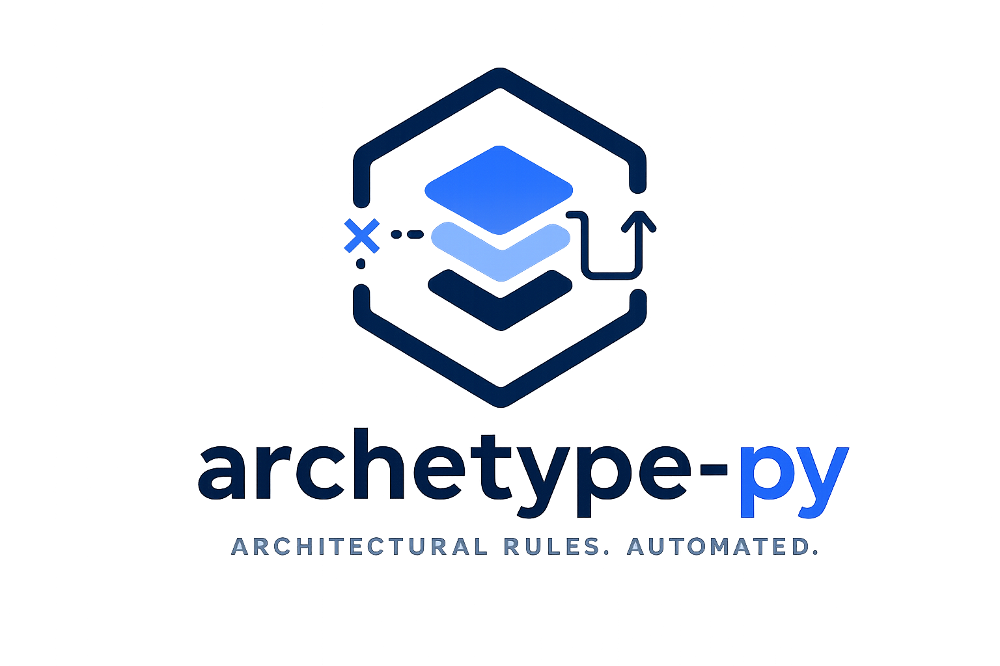

[](https://pypi.org/project/archetype-py/)
[](https://pypi.org/project/archetype-py/)
[](https://github.com/MossabArektout/archetype-py/blob/main/LICENSE)
[](https://github.com/MossabArektout/archetype-py/actions/workflows/ci.yml)


<p align="center">
  
</p>


# archetype-py

> Enforce architectural boundaries in Python before they become technical debt.

archetype-py lets teams define architecture rules like:

- “API must not depend on infrastructure”
- “No cycles between services”
- “Only repositories can access the database”

…and automatically enforce them in CI, locally, and in pytest.

---

## Why Developers Use archetype-py

Most Python tooling checks:

- formatting
- typing
- linting
- correctness

But almost nothing protects **system structure**.

As projects grow, architecture drifts silently:
- layers start leaking
- imports become tangled
- boundaries disappear
- coupling spreads

archetype-py turns architectural intent into executable checks.

---

## See It In Action

### Define architecture rules

```python
from archetype import rule
from archetype.rules import layers

@rule("layers are ordered")
def layer_order() -> None:
    layers(["myapp.api", "myapp.services", "myapp.db"]).are_ordered()
```

### Run checks

```bash
archetype check .
```

### Get actionable feedback

```text
✖ API cannot depend on DB internals

app.api.users
└── imports app.db.internal.session
```

---

## Quick Start

### 1. Install

```bash
pip install archetype-py
```

### 2. Generate a starter architecture file

```bash
archetype init .
```

### 3. Define your rules

Edit:

```text
architecture.py
```

### 4. Run checks

```bash
archetype check .
```

### 5. Add to CI

```yaml
- run: archetype check .
```

Done.

---

## Features

### Architecture Rules
- Forbidden imports
- Allowlisted imports
- Layer enforcement
- Import cycle detection
- Protected module boundaries

### Workflow Features
- Rule grouping
- Warning-level rules
- Temporary rule skips with context
- Changed-file enforcement (`since`)
- Pytest integration
- CI-friendly exit codes


## Perfect For

- Growing Python monoliths
- Modular backends
- Clean Architecture projects
- Hexagonal Architecture
- Domain-driven design
- Teams scaling beyond “tribal knowledge”

---

## Installation

```bash
pip install archetype-py
```

Requires Python 3.11+.

---

## CI Integration

archetype-py is designed for automation.

Run it:
- locally
- in pre-commit
- in GitHub Actions
- inside pytest
- in your CI pipeline

Architecture checks become part of your delivery workflow.

---

## Roadmap

Planned improvements include:
- Graph visualization
- Architecture diffing
- IDE integrations
- Rich HTML reports
- More built-in rule primitives

---

## Contributing

Contributions are welcome:
- bug fixes
- rule ideas
- docs improvements
- integrations
- performance work

See [CONTRIBUTING.md](./CONTRIBUTING.md).

---

## Support The Project

If archetype-py helps your team:

⭐ Star the repository  
🐛 Open issues  
🧠 Share feedback  
🔧 Contribute improvements

Every star genuinely helps the project grow.