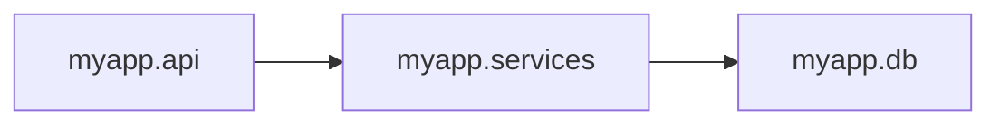
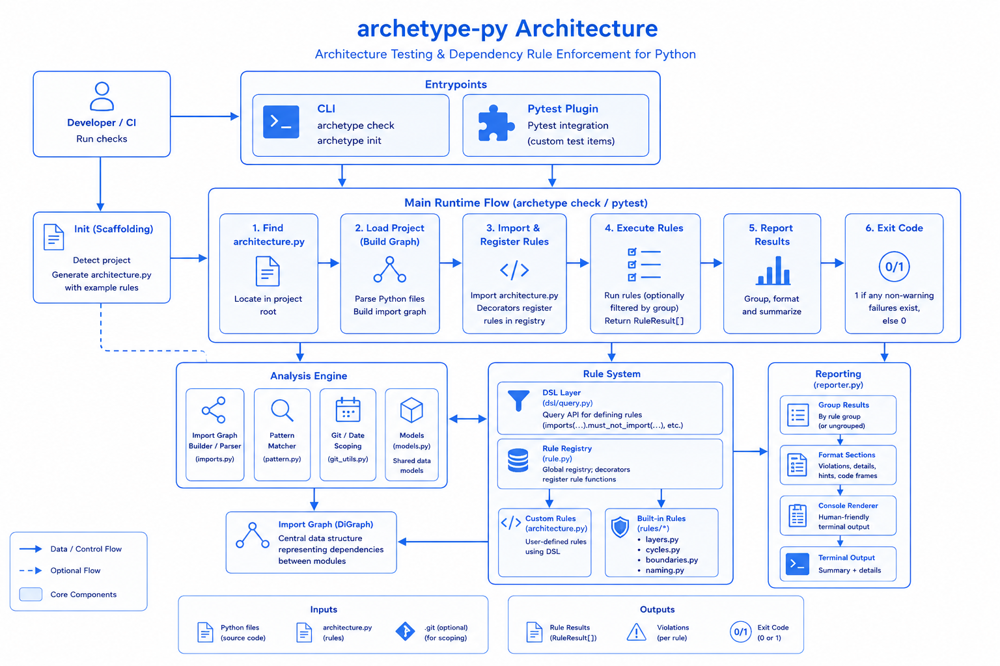

[](https://pypi.org/project/archetype-py/)
[](https://pypi.org/project/archetype-py/)
[](https://github.com/MossabArektout/archetype-py/blob/main/LICENSE)
[](https://github.com/MossabArektout/archetype-py/actions/workflows/ci.yml)
[](https://securityscorecards.dev/viewer/?uri=github.com/MossabArektout/archetype-py)

# archetype-py

Enforce architectural rules as code. Catch forbidden imports, layer leaks, cycles, and boundary violations before they merge.

`archetype-py` builds a static import graph for your Python project, runs the rules you define in `architecture.py`, and reports the result in local terminals, CI, JSON output, and pytest.

## Quick Start

Install the package:

```bash
pip install archetype-py
```

Generate a starter architecture file:

```bash
archetype init .
```

Edit `architecture.py`, then run:

```bash
archetype check .
```

For CI, add the same command:

```yaml
- run: archetype check .
```

Requires Python 3.11+.

## Why Archetype

Most Python quality tools check formatting, typing, lint rules, and test behavior. They do not usually protect system structure.

As a codebase grows, architectural drift shows up as:

- API modules importing database internals
- domain code depending on infrastructure
- services forming circular imports
- internal modules being used from the wrong package
- rules living only in team memory and code review comments

Archetype turns those expectations into executable checks.

## Minimal Example

```python
from archetype import group, imports, rule, since, warn
from archetype.rules import no_cycles

with group("Layer boundaries"):
    @rule("api-must-not-import-db")
    def api_must_not_import_db() -> None:
        imports("myapp.api").must_not_import("myapp.db")

@rule("services-should-not-use-db-internals")
@warn
def services_should_not_use_db_internals() -> None:
    imports("myapp.services").must_not_import("myapp.db.internal")

@rule("recent-code-must-not-use-legacy")
@since("2026-01-01")
def recent_code_must_not_use_legacy() -> None:
    imports("myapp.api").must_not_import("myapp.legacy")

@rule("no-import-cycles")
def no_import_cycles() -> None:
    no_cycles("myapp")
```

Run the rules:

```bash
archetype check .
```

Example output:

```text
General
=======
  ⚠ services-should-not-use-db-internals
    - myapp/services/reports.py:1
        imports myapp.db.internal.session
  ✓ recent-code-must-not-use-legacy (since 2026-01-01)
  ✓ no-import-cycles
  2 passed, 0 failed

Layer boundaries
================
  ✗ api-must-not-import-db
    - myapp/api/users.py:7
        imports myapp.db.internal.session
  0 passed, 1 failed
Summary: 2 passed, 1 failed, 1 warned, 0 skipped, 4 total rules.
```

Rules are reported under their group, with rules outside any `group()` block
collected under `General`. See [Example Output](#example-output) for passing,
failing, and warning runs side by side.

For a fuller rule file covering a layered FastAPI project (api, services,
repositories, db), see [`examples/fastapi/`](./examples/fastapi).

## Example Output

What Archetype prints for the three outcomes you will actually see.

### A passing run

Every rule holds. Each group reports its own tally, and the run exits `0`:

```text
Boundaries
==========
  ✓ api-must-not-import-db
  ✓ services-must-not-import-api
  2 passed, 0 failed

Cycles
======
  ✓ no-import-cycles
  1 passed, 0 failed

Internals
=========
  ✓ internal-helpers-stay-private
  1 passed, 0 failed
Summary: 4 passed, 0 failed, 0 warned, 0 skipped, 4 total rules.
```

### A failing run

Each violation names the file and line of the offending import, and the
module it resolved to. The run exits `1`:

```text
Boundaries
==========
  ✗ api-must-not-import-db
    - myapp/api/routes.py:2
        imports myapp.db.session
  ✓ services-must-not-import-api
  1 passed, 1 failed

Cycles
======
  ✓ no-import-cycles
  1 passed, 0 failed

Internals
=========
  ✗ internal-helpers-stay-private
    - myapp/services/reports.py:1
        imports myapp.core.internal.helpers
  0 passed, 1 failed
Summary: 2 passed, 2 failed, 0 warned, 0 skipped, 4 total rules.
```

`myapp/api/routes.py:2` is the exact import to remove, so the output can be
pasted into an editor or clicked in a terminal that linkifies paths.

### A warning run

A rule whose pattern matches no modules is reported as a warning rather than
a silent pass, with suggestions from the modules Archetype did find. This is
usually a typo or a pattern left behind after a rename:

```text
Boundaries
==========
  ⚠ controllers-must-not-import-db
    Source pattern 'myapp.controllers' matched 0 modules. Did you mean: myapp.core, myapp.core.internal.helpers, myapp.core.internal?
  0 passed, 0 failed
Summary: 0 passed, 0 failed, 1 warned, 0 skipped, 1 total rules.
```

Warnings do not fail the run — this example exits `0`. See
[Diagnostics](#diagnostics) for the patterns that are checked, and
[Exit Codes](#exit-codes) for the full list.

## Core Features

- Forbidden import rules
- Allowlisted import rules
- Transitive dependency checks
- Layer ordering rules
- Import cycle detection
- Protected internal module boundaries
- Naming convention checks
- Rule groups and targeted execution
- Warning-only rules
- Temporary skips with reasons
- Date-scoped rules with `@since`
- Scheduled warning-to-failure escalation with `@escalate`
- Baseline mode for legacy adoption
- Trend reporting of violation counts over time
- Changed-files mode for CI and large repositories
- GitHub Actions inline PR annotations
- CODEOWNERS-aware violation routing
- Project diagnostics with `archetype doctor`
- Import graph export with `archetype graph`
- Text, JSON, and SARIF report formats
- Project defaults through `archetype.toml`
- Path exclusions from CLI or config
- Import graph caching
- Pytest plugin support
- Git pre-commit hook installer
- `.pre-commit-hooks.yaml` manifest for the [pre-commit framework](https://pre-commit.com/)
- Shared, installable rule packs via `archetype.rule.use()`

## Supported Layouts

Archetype detects common Python project layouts:

- flat packages, such as `myapp/`
- single `src/` layouts, such as `src/myapp/`
- namespace packages without `__init__.py`
- monorepos with multiple nested `*/src` roots

Use `archetype doctor .` to inspect what Archetype detected.

## Commands

| Command | Purpose |
|---|---|
| `archetype init [path]` | Generate a starter `architecture.py`. |
| `archetype check [path]` | Load `architecture.py` and run all registered rules. |
| `archetype check [path] --group <name>` | Run only rules in one group. |
| `archetype check [path] --format json` | Emit machine-readable JSON report output. |
| `archetype check [path] --format sarif` | Emit SARIF 2.1.0 output for code scanning integrations. |
| `archetype check [path] --quiet` | Show only failures and warnings. |
| `archetype check [path] --no-cache` | Force a fresh import graph rebuild. |
| `archetype check [path] --exclude <pattern>` | Exclude paths from analysis and reporting. |
| `archetype check [path] --changed-from <ref>` | Report only violations in Python files changed from a Git ref. |
| `archetype check [path] --write-baseline <file>` | Write the current violations to a baseline file. |
| `archetype check [path] --baseline <file>` | Suppress matching baseline violations. |
| `archetype check [path] --github-annotations` | Emit GitHub Actions inline annotation commands. |
| `archetype check [path] --record-trend <file>` | Append this run's violation counts to a trend history file. See [Trend Reporting](#trend-reporting). |
| `archetype doctor [path]` | Explain detected project layout, graph, config, cache, and rule context. |
| `archetype graph [path] --format mermaid\|json` | Export the discovered import graph. |
| `archetype trend <file> --format text\|json` | Show violation counts recorded over time. See [Trend Reporting](#trend-reporting). |
| `archetype install-hook [path]` | Install or update a managed Git pre-commit hook. See [Pre-commit Hook](#pre-commit-hook). |

Common check flag examples:

```bash
# Run only rules in one group
archetype check . --group "Layer boundaries"

# Emit machine-readable JSON
archetype check . --format json

# Emit SARIF for code scanning integrations
archetype check . --format sarif > archetype.sarif

# Show only failures and warnings
archetype check . --quiet

# Ignore the import graph cache and rebuild from source
archetype check . --no-cache
```

## Rule Helpers

Rules are plain Python functions registered with decorators.

| Helper | Purpose | Example |
|---|---|---|
| `@rule("name")` | Register a rule with a display name. | `@rule("api-not-db")` |
| `@warn` | Report violations without failing the exit code. | `@warn` |
| `@skip` / `@skip(reason="...")` | Temporarily skip a rule. | `@skip(reason="Refactor in progress")` |
| `@since("YYYY-MM-DD")` | Only report violations in files modified after a date. | `@since("2026-01-01")` |
| `@escalate(warn_until="YYYY-MM-DD")` | Warning-only through the date, then a hard failure automatically. | `@escalate(warn_until="2026-11-01")` |
| `group("name")` | Assign enclosed rules to a group. | `with group("Layer boundaries"):` |

Decorator order tip: write `@rule(...)` as the top decorator, above wrappers such as `@warn`, `@skip`, `@since`, or `@escalate`.

```python
@rule("warning-example")
@warn
def warning_example() -> None:
    ...
```

## Gradual Severity Escalation

Rolling out a brand-new architecture rule org-wide as a hard failure on day
one blocks every pull request that happens to touch an existing violation
at once. `@escalate` schedules the transition instead: the rule is
warning-only up to a deadline, then becomes a hard failure automatically
from that date on, with no code or config change needed on the day itself.

```python
@rule("no-legacy-imports")
@escalate(warn_until="2026-11-01")
def no_legacy_imports() -> None:
    imports("myapp").must_not_import("myapp.legacy")
```

Through 2026-11-01 (inclusive), violations show up as warnings — visible
in output, but they don't fail the exit code, same as `@warn`. From
2026-11-02 onward, the same rule fails the build on any remaining
violation.

This differs from manually changing a rule's `archetype.toml` policy from
`"warning"` to `"error"` on the deadline: nobody has to remember to make
that edit, and every project depending on a [shared rule package](#shared-inheritable-rule-packs)
escalates on the same date without needing to coordinate the timing
themselves.

A rule currently in its warning period is shown with its deadline, for
example `no-legacy-imports (warn until 2026-11-01)`, and the deadline is
also included in JSON (`escalate_date`) and SARIF report output.

## Shared, Inheritable Rule Packs

Publish a set of rules as a normal installable Python package so multiple
repositories can enforce the same policy without copy-pasting
`architecture.py` between them:

```python
# In the shared package (e.g. acme_archetype_rules)
from archetype import group, imports, rule

with group("Org baseline"):
    @rule("no-direct-db-access-from-api")
    def no_direct_db_access_from_api() -> None:
        imports("api").must_not_import("db")
```

```python
# In each consuming project's architecture.py
import acme_archetype_rules
from archetype.rule import use

use(acme_archetype_rules)
```

`use()` registers every `@rule`-decorated function found in a module (or
accepts individual rule functions, or an iterable of them). Unlike a bare
`import`, it's safe to call even when the shared module was already
imported earlier in the same process — for example, a monorepo's pytest
plugin collecting multiple `architecture.py` files against the same shared
package — because Python only re-executes a module's `@rule` decorators
the first time it's imported.

A repository can still relax or disable one inherited rule locally without
touching the shared package, using the normal per-rule `policy` setting in
`archetype.toml`, matched by the rule's name:

```toml
[rules."no-direct-db-access-from-api"]
policy = "warning"
```

See [`examples/shared-rules/`](./examples/shared-rules) for a complete,
runnable example.

## Diagnostics

Use `doctor` when a rule does not behave as expected:

```bash
archetype doctor .
```

It reports detected layout, package roots, Python module count, import edge count, config source, excludes, cache status, detected layers, internal packages, and whether `architecture.py` exists.

Export the import graph for debugging or documentation:

```bash
archetype graph . --format mermaid
archetype graph . --format json
```

When a source, target, allowed, layer, boundary, cycle, or naming pattern matches no modules, Archetype reports a diagnostic warning with likely suggestions. This helps catch typos and stale rules instead of silently passing them.

## Configuration

Archetype auto-discovers `archetype.toml` from the project root passed to `archetype check [path]`.

```toml
format = "json"
quiet = true
group = "Layer boundaries"
exclude = ["/vendor/", "/migrations/"]
workers = 4
cache = true

[rules]
"legacy-boundary" = "warning"

[rules."deprecated-layer-rule"]
policy = "off"
```

Supported defaults:

- `format`: `"text"`, `"json"`, or `"sarif"`
- `quiet`: `true` or `false`
- `group`: rule group name
- `exclude`: string or list of strings
- `workers`: integer greater than or equal to `1`
- `cache`: `true` or `false`

Per-rule policy:

- `error`: fail the run when the rule fails (default)
- `warning`: report violations without failing the run or pytest
- `off`: skip the rule without executing it

Rule names are matched exactly against the name passed to `@rule("...")`.

Precedence:

1. CLI flags
2. `archetype.toml`
3. built-in defaults

For compatibility, if `archetype.toml` is missing, Archetype still reads legacy `[tool.archetype]` settings from `pyproject.toml`.

## Path Exclusions

Exclude generated code, vendored dependencies, migrations, or other noisy paths:

```bash
archetype check . --exclude /vendor/ --exclude /migrations/
```

Or define the defaults in `archetype.toml`:

```toml
exclude = ["/vendor/", "/migrations/"]
```

## Baseline Mode

Baseline mode lets you adopt Archetype in an existing codebase without failing CI on every old violation.

Create a baseline:

```bash
archetype check . --write-baseline archetype-baseline.json
```

Run against that baseline:

```bash
archetype check . --baseline archetype-baseline.json
```

Matching old violations are suppressed. New blocking violations still fail with exit code `1`.

## Trend Reporting

`archetype check --format json` already reports a violation count for that
one run. Trend reporting stores that same count over time so you can show
the story, not just today's pass/fail: "340 violations in January, 210 in
June, 90 today." No new analysis happens — the count that's already
computed is just appended to a small history file instead of discarded.

Record one entry per run, in CI or locally:

```bash
archetype check . --record-trend archetype-trend.jsonl
```

Each run appends one JSON line — safe to run repeatedly, nothing is
overwritten. Pairs naturally with [baseline mode](#baseline-mode) for
tracking a legacy-debt paydown over time.

View the recorded history:

```bash
archetype trend archetype-trend.jsonl
```

```text
Recorded at             Violations  Passed  Failed  Warned
----------------------------------------------------------
2026-01-01T00:00:00Z           340       0       1       0
2026-04-01T00:00:00Z           260       0       1       0
2026-06-01T00:00:00Z           210       0       1       0
2026-08-29T00:00:00Z            90       1       0       0

Trend (4 runs): █▆▄▁
340 -> 90 violations (down 73.5%)
```

Or get the raw series for your own dashboard/spreadsheet:

```bash
archetype trend archetype-trend.jsonl --format json
```

The trend file is a plain [JSON Lines](https://jsonlines.org/) file — one
independent JSON object per line — so a CI job can append to it without
ever reading the existing history first. Concurrent writes from parallel
CI jobs aren't guaranteed to interleave safely; record trend data from a
single job per run if that matters for your setup.

## Changed-Files Mode

Use diff scope for large projects or pull request checks:

```bash
archetype check . --changed-from origin/main
```

`<ref>` can be a branch name or commit SHA. Text output shows a scope banner, and JSON output includes a `scope` object with the changed file metadata.

## GitHub Actions

Basic CI:

```yaml
name: Architecture

on:
  pull_request:
  push:
    branches: [main]

jobs:
  archetype:
    runs-on: ubuntu-latest
    steps:
      - uses: actions/checkout@v5
      - uses: actions/setup-python@v5
        with:
          python-version: "3.11"
      - run: python -m pip install archetype-py
      - run: archetype check .
```

Inline PR annotations:

```yaml
- run: archetype check . --github-annotations
```

## GitLab CI

The command is the same as anywhere else — install Archetype, then run
`archetype check .`. Only the surrounding job syntax differs:

```yaml
archetype:
  image: python:3.11
  stage: test
  script:
    - python -m pip install archetype-py
    - archetype check .
  rules:
    - if: '$CI_PIPELINE_SOURCE == "merge_request_event"'
    - if: '$CI_COMMIT_BRANCH == "main"'
```

## Azure Pipelines

```yaml
trigger:
  branches:
    include:
      - main

pr:
  branches:
    include:
      - main

pool:
  vmImage: ubuntu-latest

steps:
  - task: UsePythonVersion@0
    inputs:
      versionSpec: "3.11"
  - script: |
      python -m pip install archetype-py
      archetype check .
    displayName: "Run Archetype"
```

## Pre-commit Hook

Archetype can catch violations before a commit is created, not after it reaches CI. There are two ways to wire this up: the [pre-commit framework](https://pre-commit.com/) (recommended if your project already uses it), or Archetype's own built-in hook installer.

### Using the pre-commit framework

Archetype ships a [`.pre-commit-hooks.yaml`](./.pre-commit-hooks.yaml) manifest, so it can be added to `.pre-commit-config.yaml` like any other tool:

```yaml
repos:
  - repo: https://github.com/MossabArektout/archetype-py
    rev: v0.4.0 # use the latest tag
    hooks:
      - id: archetype
```

Then install the hook and run it:

```bash
pre-commit install
pre-commit run archetype --all-files
```

The hook runs `archetype check` against the repository root on every commit (it does not accept a `--changed-from`-style per-file mode, since rules need the full import graph). `pre-commit` installs Archetype into its own managed environment, so your project's virtualenv does not need Archetype installed for the hook to work.

### Using the built-in installer

If you don't use the pre-commit framework, Archetype can install a managed Git hook directly:

```bash
archetype install-hook .
```

```
Installed pre-commit hook at /path/to/project/.git/hooks/pre-commit
Hook command: archetype check /path/to/project
```

The hook is written to the repository's `pre-commit` hook path and made executable. The installed block runs `archetype check` against the repository root, so every commit is checked against the full project, not only the staged files.

### Verifying the hook

Make a commit. A clean project reports its summary and the commit proceeds:

```
$ git commit -m "add service layer"
Summary: 1 passed, 0 failed, 0 warned, 0 skipped, 1 total rules.
[main 1a2b3c4] add service layer
```

A commit that breaks a rule prints the violation and is rejected:

```
$ git commit -m "add cycle"
Cycles
======
  ✗ no-cycles
    - myapp/a.py:1
        imports <unknown>
  0 passed, 1 failed
Summary: 0 passed, 1 failed, 0 warned, 0 skipped, 1 total rules.
```

The commit is not created. Use `git commit --no-verify` to bypass the hook deliberately.

### Requirements and behaviour

`archetype` must be available on `PATH` for the hook to run. The hook checks this first and fails the commit with a clear message rather than passing silently:

```
archetype: CLI not found on PATH. Install archetype to run checks.
```

If you install Archetype into a virtualenv, that environment must be active when you commit, or Git tools that run outside it will not find the CLI.

The command is safe to re-run and reports what it did:

| Situation | Result |
| --- | --- |
| No hook present | `Installed pre-commit hook at ...` |
| Archetype block already current | `Archetype pre-commit hook already installed at ...` |
| Archetype block present but outdated | `Updated Archetype block in pre-commit hook at ...` |
| Some other hook already present | `Appended Archetype block to existing pre-commit hook at ...` |

Archetype only owns the region between its markers, so an existing hook is preserved:

```sh
# >>> archetype pre-commit hook >>>
...
# <<< archetype pre-commit hook <<<
```

Because the block is appended, an existing hook that exits before reaching it will prevent the Archetype check from running. If your hook ends with an explicit `exit`, move the Archetype block above it.

To uninstall, delete that block from `.git/hooks/pre-commit` (or delete the file if Archetype is its only content). Running the command outside a Git repository exits with status `1`:

```
Error: Unable to resolve git hooks path: fatal: not a git repository (or any of the parent directories): .git
```

## Pytest

Archetype ships a pytest plugin. With the package installed, pytest can collect rules from `architecture.py` and report them as test items.

```bash
pytest
```

This is useful when architecture rules should live beside the rest of the test suite.

## JSON Report Contract

`archetype check --format json` emits a versioned report contract.

Current report schema:

```text
schema_version: 2
```

Top-level fields:

- `schema_version`: report contract version
- `summary`: counts for passed, failed, warned, skipped, and total rules
- `violations`: total, new, and baseline-suppressed violation counts
- `rules`: per-rule results
- `scope`: optional changed-files metadata when `--changed-from` is used

Each rule includes:

- `name`
- `status`
- `group`
- `since_date`
- `escalate_date`
- `policy`
- `violations`
- `diagnostics`

Each violation includes:

- `module`
- `file`
- `line`
- `target`
- `message`
- `owners`: CODEOWNERS entries matching the violation's file, if a
  [CODEOWNERS file](#codeowners-integration) is present (empty otherwise)

Example:

```json
{
  "schema_version": 2,
  "summary": {
    "passed": 2,
    "failed": 1,
    "warned": 0,
    "skipped": 0,
    "total": 3
  },
  "violations": {
    "total": 1,
    "new": 1,
    "suppressed": 0
  },
  "rules": [
    {
      "name": "api-must-not-import-db",
      "status": "failed",
      "group": "Layer boundaries",
      "since_date": null,
      "escalate_date": null,
      "policy": "error",
      "violations": [
        {
          "module": "myapp.api.users",
          "file": "myapp/api/users.py",
          "line": 7,
          "target": "myapp.db.internal.session",
          "message": "Module 'myapp.api.users' must not import 'myapp.db' (found import to 'myapp.db.internal.session').",
          "owners": ["@acme/api-team"]
        }
      ],
      "diagnostics": []
    }
  ]
}
```

Non-breaking additions keep the same schema version. Breaking shape changes increment `schema_version`.

Note: `archetype graph --format json` has its own graph export schema.

## SARIF Output

`archetype check --format sarif` emits SARIF 2.1.0 JSON for GitHub Code Scanning and other SARIF-compatible tools.

```bash
archetype check . --format sarif > archetype.sarif
```

Each Archetype rule is emitted as a SARIF rule descriptor using the rule name as the stable `ruleId`. Each violation is emitted as a SARIF result with a readable message, severity level, source module, imported target, and file/line location when available.

## CODEOWNERS Integration

A generic "CI failed" tells whoever opened the PR that something broke, not
who is actually responsible for the module involved. If a
[`CODEOWNERS`](https://docs.github.com/en/repositories/managing-your-repositorys-settings-and-features/customizing-your-repository/about-code-owners)
file exists, Archetype reads it automatically — no separate ownership file
to maintain — and routes each violation to the team or user who owns the
affected path:

```text
General
=======
  ✗ api-must-not-import-db
    - myapp/api/users.py:7
        imports myapp.db.internal.session
        owner: @acme/data-team
```

The owner also appears in JSON (`owners`), SARIF (`properties.owners`), and
GitHub Actions inline annotations (prefixed to the message, e.g.
`@acme/data-team: api-must-not-import-db: ...`).

Archetype checks the same locations and precedence GitHub itself uses:

1. `.github/CODEOWNERS`
2. `CODEOWNERS` (repository root)
3. `docs/CODEOWNERS`

Matching follows CODEOWNERS' own last-match-wins rule, same as
`.gitignore`: later patterns in the file override earlier ones for the
same path. No configuration is required — if none of the three files
exist, violations are reported exactly as before.

## Import Graph Export

Mermaid output is useful for docs:

```bash
archetype graph . --format mermaid
```


```mermaid
graph LR
  m_myapp_api["myapp.api"]
  m_myapp_services["myapp.services"]
  m_myapp_db["myapp.db"]
  m_myapp_api --> m_myapp_services
  m_myapp_services --> m_myapp_db
```

JSON output is useful for integrations:

```bash
archetype graph . --format json
```

The graph export includes `nodes` and `edges`; each edge includes `source`, `target`, `file`, and `line`.

## Architecture Visual

<p align="center">
  
</p>

Additional diagrams are available in [`assets/`](./assets).

## Exit Codes

- `0`: no blocking failures
- `1`: one or more blocking failures

Warning-only rules do not fail the process. When `--baseline` is used, exit code `1` means there are new blocking violations not present in the baseline.

## Development

Install development dependencies:

```bash
pip install -e ".[dev]"
```

Run tests:

```bash
pytest
```

Run Archetype against itself:

```bash
archetype check .
```

Build the package:

```bash
hatch build
```

## Troubleshooting

`Error: architecture.py not found`

Run `archetype init .` in your project root, or pass the correct path to `archetype check <path>`.

Rules seem to do nothing

Confirm the functions are decorated with `@rule("...")`. Undecorated functions are not registered.

Pattern matches no modules

Run `archetype doctor .`, then check that your patterns use fully qualified module names such as `myapp.api`, not file paths such as `src/api.py`.

`@since(...)` behaves unexpectedly

Use `YYYY-MM-DD` format and make sure Git history is available in the checked path.

Imports are missing from the graph

Check that modules live under detected package roots. `archetype doctor .` shows the roots Archetype is using.

## Security

Archetype makes no network calls and sends no telemetry. It only reads
source files from disk and writes reports to stdout or the file/path you
specify.

`architecture.py` is loaded and executed as ordinary Python, not parsed as
inert data — rules can do anything Python can do, with the same privileges
as the process running `archetype check`. Do not run `archetype check`
against untrusted, unreviewed changes (for example, code from a fork PR)
in a CI job that has write permissions or access to secrets. See
[`SECURITY.md`](./SECURITY.md) for the full security model and how to
report a vulnerability.

## Roadmap

Planned work is tracked in [GitHub Issues](https://github.com/MossabArektout/archetype-py/issues) and milestones.

## Contributing

Contributions are welcome: bug fixes, rule ideas, documentation improvements, integrations, and performance work.

See [`CONTRIBUTING.md`](./CONTRIBUTING.md).

## License

MIT. See [`LICENSE`](./LICENSE).
